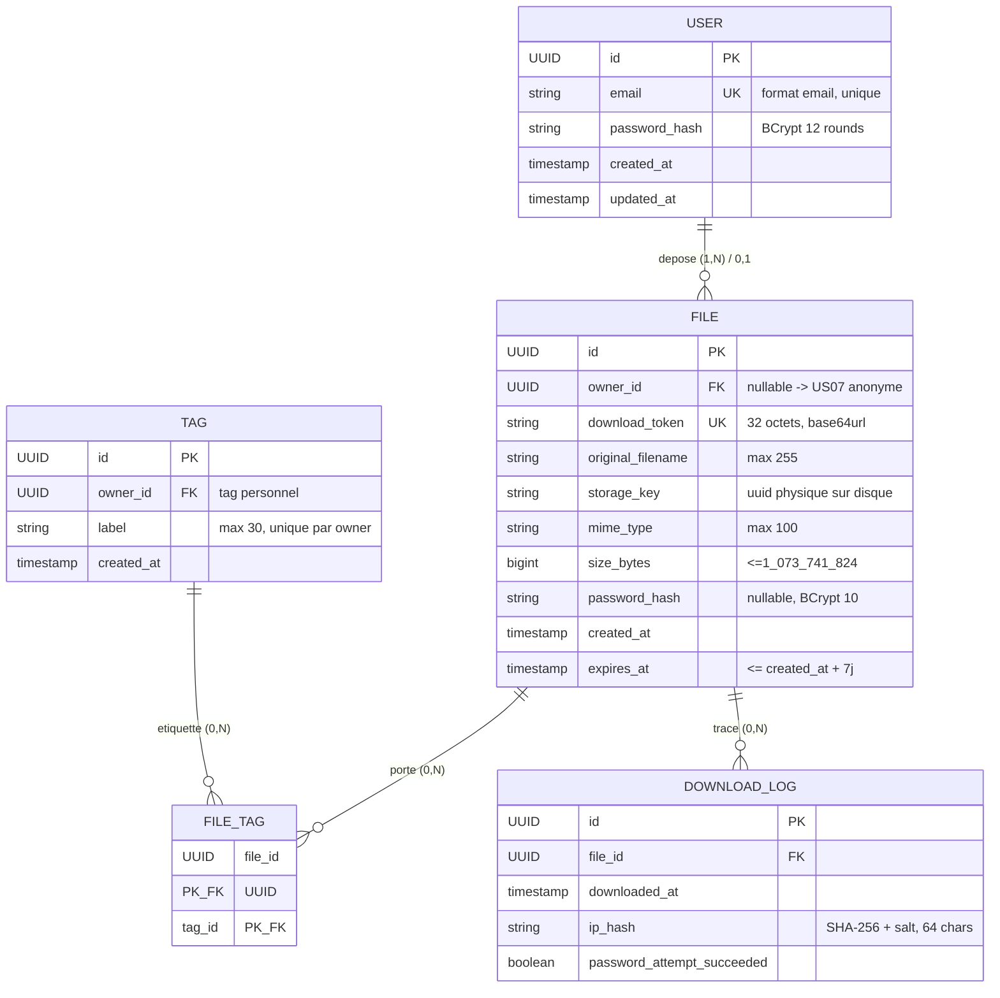

# DataShare — Modèle Conceptuel de Données (MCD)

> Document de conception — Étape 1
> Référent technique : Manu — Avril 2026

## 1. Notation utilisée

Modèle de type **Merise** (MCD) : entités et associations avec cardinalités.
Pour le rendu visuel, j'utilise un diagramme Entité-Relation Mermaid (ER) qui se rapproche le plus possible du formalisme Merise tout en restant directement rendu sur GitHub/GitLab.

> **Convention cardinalités** :
> - `0..N` : zéro à plusieurs
> - `1..N` : un à plusieurs
> - `0..1` : zéro ou un
> - `1..1` : un et un seul

## 2. Diagramme MCD



## 3. Description Merise détaillée

### 3.1 Entités

#### USER (Utilisateur)
Représente un compte authentifié. Couvre **US03, US04, US05, US06**.

| Attribut | Type | Contraintes | Justification |
|---|---|---|---|
| `id` | UUID | **PK**, généré par défaut `gen_random_uuid()` | Clé technique non-exposée |
| `email` | VARCHAR(255) | **NOT NULL**, **UNIQUE**, format email | US03 — unicité requise |
| `password_hash` | VARCHAR(72) | **NOT NULL** | BCrypt 60 chars + marge |
| `created_at` | TIMESTAMP WITH TIME ZONE | **NOT NULL**, default `NOW()` | Audit |
| `updated_at` | TIMESTAMP WITH TIME ZONE | **NOT NULL**, trigger update | Audit |

Pas de champ `role` : le MVP ne prévoit pas d'administrateur (cf. spec).

#### FILE (Fichier)
Représente un fichier téléversé. Couvre **US01, US02, US06, US07, US09, US10**.

| Attribut | Type | Contraintes | Justification |
|---|---|---|---|
| `id` | UUID | **PK** | Clé technique |
| `owner_id` | UUID | **FK** → USER.id, **NULL autorisé** | NULL = upload anonyme (US07, optionnel) |
| `download_token` | VARCHAR(64) | **NOT NULL**, **UNIQUE**, **INDEX** | Token public non prédictible (US01) |
| `original_filename` | VARCHAR(255) | **NOT NULL** | Nom affiché à l'utilisateur |
| `storage_key` | VARCHAR(255) | **NOT NULL**, **UNIQUE** | UUID physique sur disque (anti path traversal) |
| `mime_type` | VARCHAR(100) | **NOT NULL** | Pour `Content-Type` au download |
| `size_bytes` | BIGINT | **NOT NULL**, CHECK ≤ 1 073 741 824 | US01 — max 1 Go |
| `password_hash` | VARCHAR(72) | **NULL autorisé** | NULL = pas de mot de passe (US01/US09) |
| `created_at` | TIMESTAMP WITH TIME ZONE | **NOT NULL**, default `NOW()` | Affiché dans l'historique (US05) |
| `expires_at` | TIMESTAMP WITH TIME ZONE | **NOT NULL**, CHECK ≤ `created_at + 7 days` | US01/US10 |

#### TAG (Étiquette)
Couvre **US08** (fonctionnalité avancée, mais modélisée dès le MCD pour anticiper).

| Attribut | Type | Contraintes |
|---|---|---|
| `id` | UUID | **PK** |
| `owner_id` | UUID | **FK** → USER.id, **NOT NULL** |
| `label` | VARCHAR(30) | **NOT NULL**, **UNIQUE (owner_id, label)** |
| `created_at` | TIMESTAMP WITH TIME ZONE | **NOT NULL** |

> Choix : un tag est **personnel à un utilisateur**. Cela évite le bruit du multi-tenant et simplifie le modèle.

#### DOWNLOAD_LOG (Journal de téléchargement)
Trace les téléchargements pour PERF.md et SECURITY.md (anti-bruteforce).

| Attribut | Type | Contraintes |
|---|---|---|
| `id` | UUID | **PK** |
| `file_id` | UUID | **FK** → FILE.id, ON DELETE CASCADE |
| `downloaded_at` | TIMESTAMP WITH TIME ZONE | **NOT NULL** |
| `ip_hash` | CHAR(64) | **NOT NULL** | SHA-256 (RGPD : pas d'IP en clair) |
| `password_attempt_succeeded` | BOOLEAN | **NOT NULL** |

### 3.2 Associations

| Association | Entités | Cardinalités | Sens métier |
|---|---|---|---|
| **DEPOSE** | USER ↔ FILE | USER (0,N) — FILE (0,1) | Un user dépose 0..N fichiers ; un fichier appartient à 0..1 user (NULL = anonyme) |
| **PORTE** (via FILE_TAG) | FILE ↔ TAG | FILE (0,N) — TAG (0,N) | N..N résolue par table de jointure |
| **TRACE** | FILE ↔ DOWNLOAD_LOG | FILE (0,N) — LOG (1,1) | Un log appartient à un seul fichier |

## 4. Modèle Logique (MLD) — passage en relationnel

```sql
-- USERS
CREATE TABLE users (
    id              UUID PRIMARY KEY DEFAULT gen_random_uuid(),
    email           VARCHAR(255) NOT NULL UNIQUE,
    password_hash   VARCHAR(72)  NOT NULL,
    created_at      TIMESTAMPTZ  NOT NULL DEFAULT NOW(),
    updated_at      TIMESTAMPTZ  NOT NULL DEFAULT NOW()
);

-- FILES
CREATE TABLE files (
    id                 UUID PRIMARY KEY DEFAULT gen_random_uuid(),
    owner_id           UUID REFERENCES users(id) ON DELETE CASCADE,
    download_token     VARCHAR(64)  NOT NULL UNIQUE,
    original_filename  VARCHAR(255) NOT NULL,
    storage_key        VARCHAR(255) NOT NULL UNIQUE,
    mime_type          VARCHAR(100) NOT NULL,
    size_bytes         BIGINT       NOT NULL CHECK (size_bytes > 0 AND size_bytes <= 1073741824),
    password_hash      VARCHAR(72),
    created_at         TIMESTAMPTZ  NOT NULL DEFAULT NOW(),
    expires_at         TIMESTAMPTZ  NOT NULL,
    CONSTRAINT chk_expires_max_7d CHECK (expires_at <= created_at + INTERVAL '7 days')
);
CREATE INDEX idx_files_token        ON files (download_token);
CREATE INDEX idx_files_owner        ON files (owner_id);
CREATE INDEX idx_files_expires_at   ON files (expires_at);

-- TAGS
CREATE TABLE tags (
    id          UUID PRIMARY KEY DEFAULT gen_random_uuid(),
    owner_id    UUID NOT NULL REFERENCES users(id) ON DELETE CASCADE,
    label       VARCHAR(30) NOT NULL,
    created_at  TIMESTAMPTZ NOT NULL DEFAULT NOW(),
    CONSTRAINT uq_tag_owner_label UNIQUE (owner_id, label)
);

-- FILE_TAGS (table pivot N..N)
CREATE TABLE file_tags (
    file_id UUID NOT NULL REFERENCES files(id) ON DELETE CASCADE,
    tag_id  UUID NOT NULL REFERENCES tags(id)  ON DELETE CASCADE,
    PRIMARY KEY (file_id, tag_id)
);

-- DOWNLOAD_LOGS
CREATE TABLE download_logs (
    id                            UUID PRIMARY KEY DEFAULT gen_random_uuid(),
    file_id                       UUID NOT NULL REFERENCES files(id) ON DELETE CASCADE,
    downloaded_at                 TIMESTAMPTZ NOT NULL DEFAULT NOW(),
    ip_hash                       CHAR(64) NOT NULL,
    password_attempt_succeeded    BOOLEAN NOT NULL
);
CREATE INDEX idx_logs_file ON download_logs (file_id);
```

## 5. Décisions de modélisation justifiées

| Décision | Raison |
|---|---|
| `users.id` en **UUID** plutôt que serial | Pas de fuite d'information sur le nombre d'utilisateurs, compatible federation future |
| `files.owner_id` **nullable** | Anticipe US07 (upload anonyme) sans changer le schéma |
| `files.storage_key` distinct de `original_filename` | Empêche les attaques par path traversal et les collisions de noms |
| `files.password_hash` **nullable** | Reflète que le mot de passe est optionnel (US09) |
| `files.expires_at` plutôt que `expires_in` | Évite le calcul à chaque lecture, indexable directement |
| Table **`download_logs`** séparée | Permet l'agrégation pour PERF.md sans alourdir `files` |
| Pas de `is_deleted` (soft delete) | Spécifications : suppression irréversible US06, conforme RGPD |
| `tags` rattaché au user, pas global | Évite la pollution multi-utilisateurs et le besoin de modération |
| `ON DELETE CASCADE` sur `owner_id` | Garantit la suppression complète d'un compte (RGPD) |

## 6. Volumétrie estimée (ordre de grandeur, MVP démo)

| Table | Lignes attendues | Croissance |
|---|---|---|
| users | ~ 100 | quelques par jour |
| files | ~ 1 000 actifs (purge 7j) | ~ 200/jour |
| tags | ~ 500 | linéaire avec users |
| file_tags | ~ 2 000 | 2 tags/fichier en moyenne |
| download_logs | ~ 5 000/mois | rotation/archivage > 90 jours |

Index B-tree suffisants pour cette volumétrie ; optimisations (partitionnement) à reporter post-MVP.
